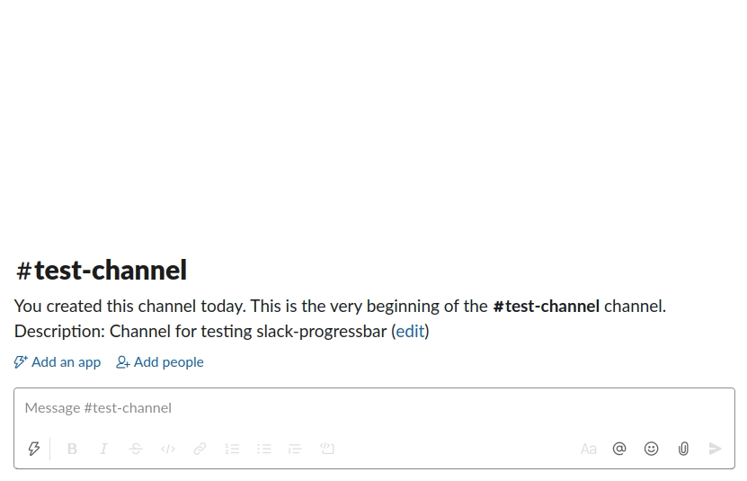

# slack-progressbar

This is a simple library for creating and updating Slack messages that contain progress bars.

It can be used to display the progress of a long-running task in a Slack channel, for example as part of CI tooling.

See the code in [Main.hs](./app/Main.hs) for an example which generates the video below.

# Example

